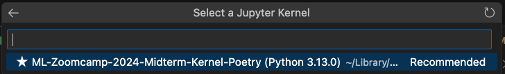
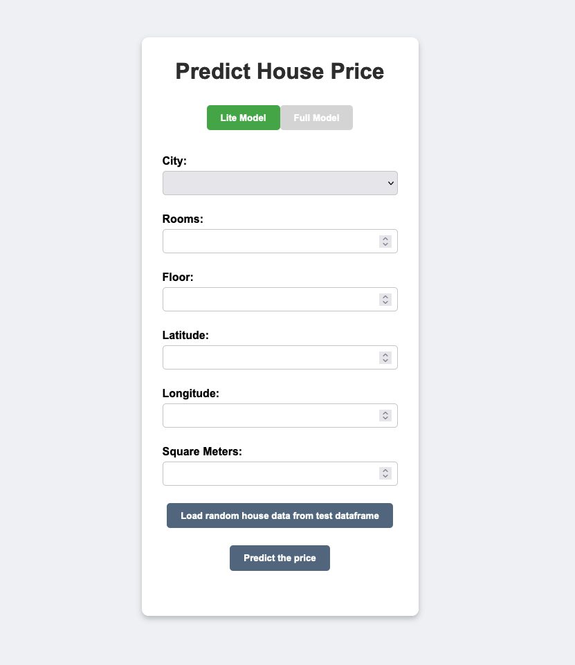

House Price Prediction Project
==============================

This project includes a machine learning scripts for predicting house prices in Poland, offering both "Lite" and "Full" model types. The setup allows for easy installation, training, and serving, as well as deploying in a Docker container.

Data Overview
-------------

This dataset contains information about real estate listings in various cities across Poland. Data somes from [House Prices in Poland](https://www.kaggle.com/datasets/dawidcegielski/house-prices-in-poland/data)
Each row represents a unique property with attributes that describe its location, size, price, and other details. Below are descriptions of the key columns:

- address: A string that includes the area or street name, often along with additional descriptive details about the property’s neighborhood or condition.
- city: The city where the property is located: Kraków, Warszawa, or Poznań.
- floor: The floor on which the property is located within a building.
- id: A unique identifier for each property, given as a float.
- latitude and longitude: GPS coordinates indicating the exact location of the property, useful for mapping or spatial analysis.
- price: The listed price of the property in PLN (Polish złoty), which varies significantly depending on the city, size, and other factors.
- rooms: The number of rooms in the property, also represented as a float. This provides a rough indication of the property size.
- sq: The area of the property in square meters, which is a key factor in determining its price and overall size.
- year: The year of construction.

### Project Goal
The goal of this project is to create a tool that can predict real estate prices, helping buyers, sellers, and real estate agents make informed decisions about property values. By leveraging historical data, the model aims to provide reliable price estimates based on property attributes.

### Data Sources and Features
The project uses data with the following key features:

- Location: City, address, latitude, and longitude provide spatial context.
- Physical Attributes: Square footage, number of rooms, and floor level.
- Economic Attribute: Property price, which serves as the target variable for prediction.
- Temporal Attribute: Construction year, which can be indicative of the property’s condition and style.

### Machine Learning Approach
- Data Processing: The data is preprocessed to handle outliers, and standardize or encode features as needed.
- Feature Engineering: Features like "price per square meter" and categorical encodings for location may be added to enhance the model's predictive power.
- Model Training and Evaluation: Two versions of the model— `Lite` and `Full` — are trained. The Lite model uses a subset of the features, making it faster but potentially less accurate, while the Full model uses the complete feature set.
  - The main difference between this to models is lack of the address in the `Lite` version. The address feature has many unique values (which creates a massive number of columns when using one-hot encoding). This causes the model to struggle as it tries to fit on a high-dimensional and sparse matrix, which can lead to unstable predictions and inflated error values like the RMSE you observed. From my tests, it comes out that insufficient address data causes the model to later not be able to predict well the price for addresses it did not know before.
- Model Deployment: The trained model can be served through an API (e.g., using Flask) that takes in new property details and returns a predicted price, allowing for integration with applications or websites.

### Expected Outcomes
The project delivers:

- A Prediction API: A simple interface to receive property details and return a price estimate.
- Insights into Property Pricing: Analysis of the data may yield insights on key pricing factors, trends by city, and other valuable real estate metrics.
- Flexibility in Model Use: With both Lite and Full models, the user can choose between faster predictions with fewer features or more comprehensive predictions with all features.

Prerequisites
-------------

*   **Python 3.11**
*   **Poetry** (for dependency management)
*   **Docker** (for containerization)
*   **Make** (for running Makefile commands)

Installation
------------

### Option 1: Using the Makefile

The Makefile ([check how to install](#install-make)) provides a streamlined way to install dependencies and manage the environment.

*   **Install testing dependencies** (for Jupyter, matplotlib, etc.):
    
        make start_jupyter
    
*   **Install deployment dependencies** (for running the server):
    
        make server
    

### Option 2: Using Poetry Directly

Ensure that **Poetry** is installed. If not, install it using:

    curl -sSL https://install.python-poetry.org | python3 -

Then, install dependencies with Poetry:

*   **All dependencies** (`RECOMMENDED`):
    
        poetry install

*   **Testing dependencies** (for Jupyter, matplotlib, etc.):
    
        poetry install --with test
    
*   **Deployment dependencies** (for running the server):
    
        poetry install --with deploy
    

### Option 3: Manual Installation with Conda

If you don’t want to use Poetry, you can install the dependencies manually:

    conda create -n machine-learning-zoomcamp-2024-midterm python=3.11
    conda activate machine-learning-zoomcamp-2024-midterm
    conda install numpy pandas scikit-learn seaborn jupyter category_encoders

Running Jupyter Notebook
------------------------

### Option 1: Using the Makefile

The `start_jupyter` target will install the testing dependencies and create a Jupyter kernel named "ML-Zoomcamp-2024-Midterm-Kernel-Poetry".

    make start_jupyter

### Option 2: Using Poetry Directly

Install testing dependencies and set up the kernel:

    poetry install --with test
    poetry run python -m ipykernel install --user --name=machine-learning-zoomcamp-2024-midterm --display-name "ML-Zoomcamp-2024-Midterm-Kernel-Poetry"

## Select the Kernel

Once `Jupyter kernel` is created `ML-Zoomcamp-2024-Midterm-Kernel-Poetry`

### in VS Code
- Open VS Code and go to your .ipynb notebook file.
- Click on the kernel selection dropdown in the top right corner of the notebook interface.
- Look for the kernel named `ML-Zoomcamp-2024-Midterm-Kernel-Poetry`
- Select this kernel. This will use the environment and dependencies managed by Poetry.

Training the Model
------------------

This project supports two types of models: `lite` and `full`.

### Option 1: Using the Makefile

To train either model, use the appropriate Makefile target:

*   **Lite Model**:
    
        make train_lite
    
*   **Full Model**:
    
        make train_full

or you can train both (required by the predict script)
*   **Both Model**:
    
        make train

### Option 2: Using Poetry Directly

Alternatively, use Poetry directly to install dependencies and train the model with model type specified:

*   **Lite Model**:
    
        poetry install --with test
        poetry run python3 train.py --model_type=lite
    
*   **Full Model**:
    
        poetry install --with test
        poetry run python3 train.py --model_type=full
    

Serving the Model with Flask
----------------------------

The model can be served via Flask, making it accessible for predictions.

### Option 1: Using the Makefile

To serve the model:

    make server

### Option 2: Using Poetry Directly

Install deployment dependencies and run the server:

    poetry install --with deploy
    poetry run python3 predict.py

Once the dependencies are installed and script started, you’ll see a message to open your browser at `http://127.0.0.1:8080` to access the application.    

Using Docker for Containerization
---------------------------------

### Build and Run the Docker Container

1.  **Build the Docker image**:
    
        make container
    
2.  **Run the Docker container** (exposing port 8080):
    
        make run_container

Once the container starts, you’ll see a message to open your browser at `http://localhost:8080` to access the application.

3.  **Stop the Docker container**:
    
        make stop_container  

Using the WebApp to predict the house price
---------------------------------
       

#### Model Selection (Lite or Full)

- At the top of the page, there is a switch for selecting the type of model to use for the prediction.
  - Lite Model: Selects a model that uses fewer features for prediction (less computation).
  - Full Model: Selects a more complex model that includes more features for prediction.

#### House Data Input Form
- A form is provided for the user to input various details about a house. The fields available depend on whether the Lite Model or Full Model is selected.
- Fields (Lite Model):
  - City: The city where the house is located.
  - Floor: The floor number of the house.
  - Latitude: The latitude coordinate of the house.
  - Longitude: The longitude coordinate of the house.
  - Rooms: The number of rooms in the house.
  - Square Meters (sq): The total area of the house in square meters.
- Fields (Full Model) (These fields are shown when the Full Model is selected):
  - All the fields from the Lite Model, plus:
  - Year: The year the house was built.
  - Address: The street address of the house.

#### Random House Button
- This button generates a random house (from test dataset) and fills the form with data for that house. - It’s a useful feature if users just want to test the application without entering specific data.

#### Summary of Functionality:
- Lite Model: Shows only essential fields for a quick prediction with fewer features.
- Full Model: Displays additional fields for a more accurate prediction using more features.
- Generate Random House: Populate the form with random data for testing.
- Predict Price: Submit the filled form to get the predicted price for the house.

After filling in the form, the user clicks the Predict Price button to get a prediction based on the house details they’ve entered.

Test the model online
---------------------------------

Alternatively, both models - `lite` and `full` are avarialbe online for tests:
https://house-prices-latest.onrender.com/

How to
---------------------------------

### Install Make
#### On Linux
- `make` is usually pre-installed on most Linux distributions.
- If not, you can install it via the package manager:
        - Debian/Ubuntu: `sudo apt install make`
        - Fedora/RHEL/CentOS: `sudo dnf install make` (or `yum` on older versions)
#### On macOS
- `make` is generally included with the Xcode Command Line Tools.
- If it’s missing, install Xcode Command Line Tools by running:        
    
        xcode-select --install

#### On Windows
- Make is not natively available on Windows.
- Options for installing make on Windows include:
  - Git Bash: Install Git for Windows, which includes Git Bash and comes with make. You can run make from Git Bash.
  - Chocolatey: If you use Chocolatey, you can install make with:
            
        choco install make

  - WSL (Windows Subsystem for Linux): Installing WSL allows you to run a Linux environment on Windows, where make can be installed as usual.

After installation, you can verify that make is accessible by running:

        make --version